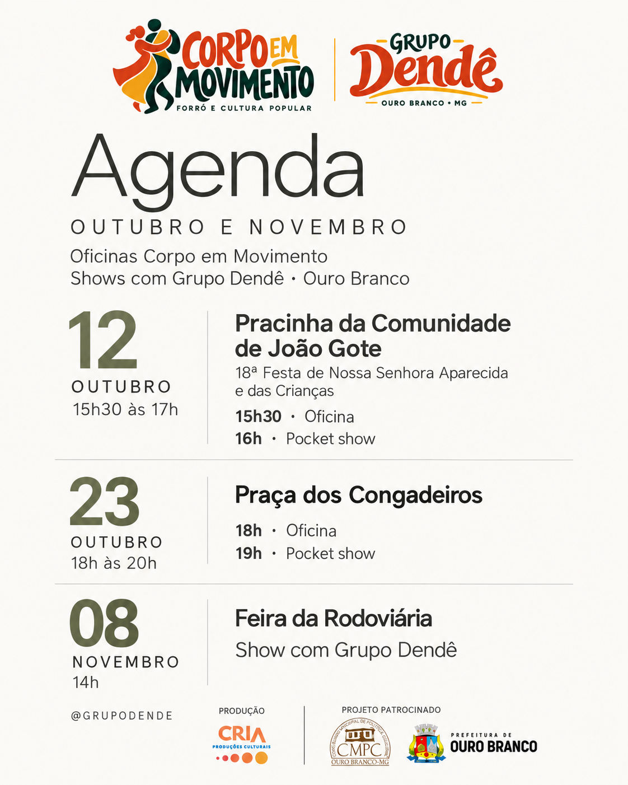

# Agenda unificada — Outubro e Novembro

Uma única arte com as três datas, fundo neutro e tipografia leve.

**[Baixar a imagem em PNG](agenda-outubro-novembro.png?raw=true)** · **[Baixar o PDF](agenda-outubro-novembro.pdf?raw=true)**

## Programação

- **12 de outubro, das 15h30 às 17h** — Pracinha da Comunidade de João Gote, na 18ª Festa de Nossa Senhora Aparecida e das Crianças. Oficina Corpo em Movimento às **15h30** e pocket show com Grupo Dendê às **16h**.
- **23 de outubro, das 18h às 20h** — Praça dos Congadeiros. Oficina Corpo em Movimento às **18h** e pocket show com Grupo Dendê às **19h**.
- **8 de novembro, às 14h** — Feira da Rodoviária. Show com Grupo Dendê.

Se a imagem abrir no navegador, escolha **Salvar imagem como…**. No GitHub, também é possível usar a seta de **Download raw file**.
